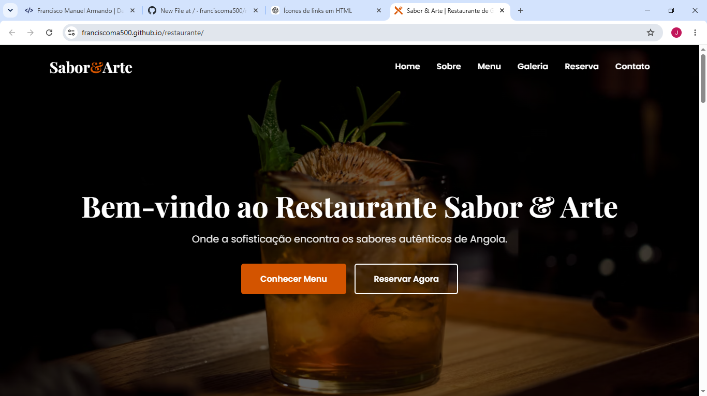
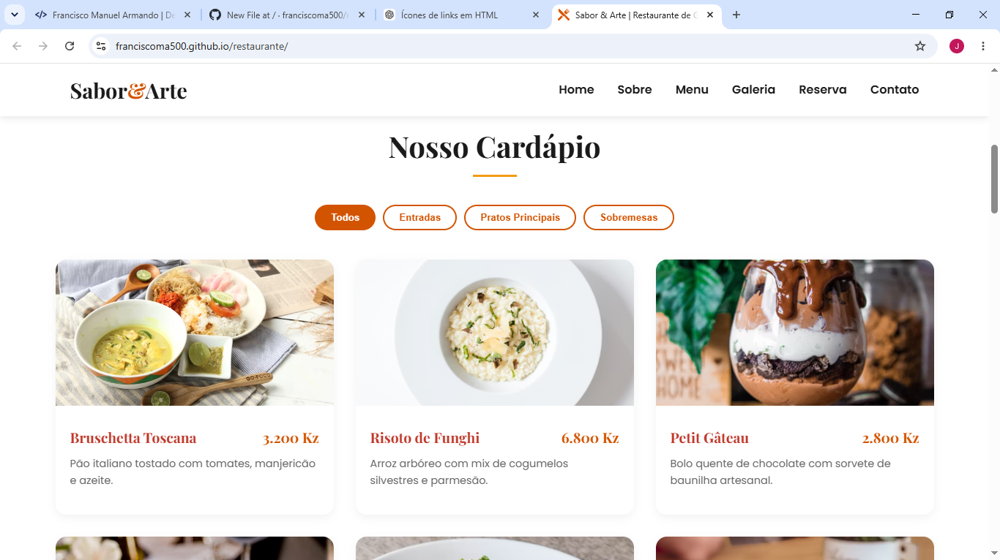
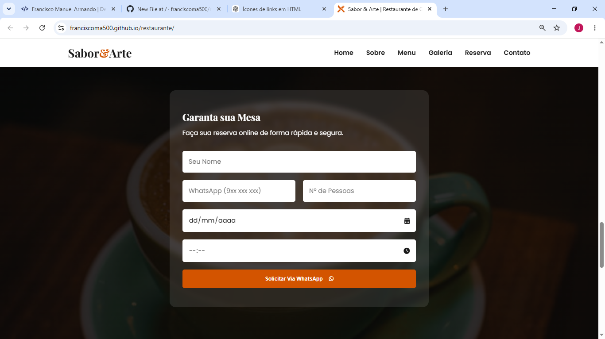

# 🍽️ Sabor & Arte - Website de Restaurante

Website moderno e responsivo desenvolvido para um restaurante fictício, com o objetivo de apresentar o menu, serviços e facilitar o contacto com clientes.

---

## 🚀 Visão Geral

O projeto **Sabor & Arte** foi criado para oferecer uma experiência digital elegante e intuitiva para um restaurante, permitindo que clientes conheçam o menu, façam reservas e entrem em contacto de forma rápida.

---

## ✨ Funcionalidades

- 📱 Design totalmente responsivo (mobile, tablet e desktop)
- 🍽️ Apresentação digital do menu
- 📅 Formulário de reserva
- 🎨 Interface moderna e atrativa
- ⚡ Site leve e rápido
- 🧭 Navegação simples e intuitiva

---

## 🛠️ Tecnologias Utilizadas

### Front-End
- HTML5
- CSS3
- SCSS
- JavaScript

### Ferramentas
- Git
- GitHub
- VS Code
- Gemini(Design)

---

## 📸 Pré-visualização

  

  

  

---

## 🌐 Demonstração

🔗 Website ao vivo:  
https://franciscoma500.github.io/restaurante

---

## 🎯 Objetivo do Projeto

Este projeto foi desenvolvido com o objetivo de:
- Criar uma presença digital para restaurantes
- Melhorar a experiência do cliente
- Facilitar reservas e contacto direto
- Demonstrar competências em desenvolvimento web

---

## 📈 Melhorias Futuras

- 💳 Sistema de pagamento online
- 📦 Pedido de comida online (delivery)
- 🌍 Versão multi-idioma (PT/EN)
- 🗂️ Painel administrativo para gerir menu
- ⭐ Sistema de avaliações de clientes

---

## 📬 Contacto

📧 Email: franciscomanuelarmando500@email.com  
📱 WhatsApp: https://wa.me/244951414234
🌐 Portfólio: https://franciscoma500.github.io/portifolio-official

---

> 💡 Projeto desenvolvido com foco em design moderno, performance e experiência do utilizador.
